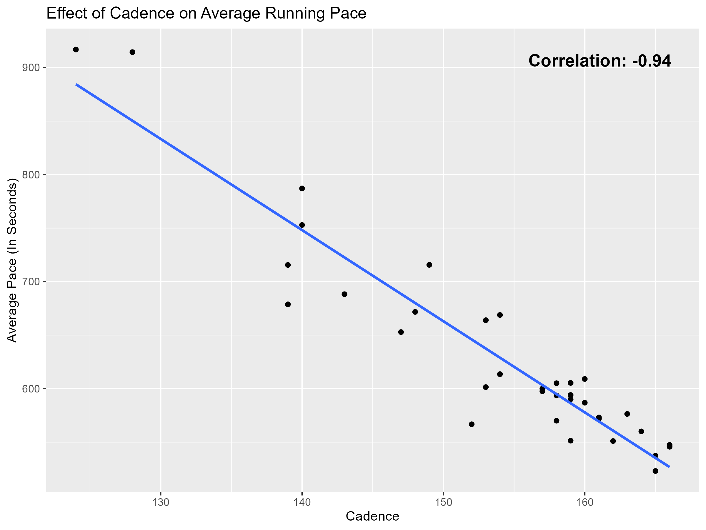
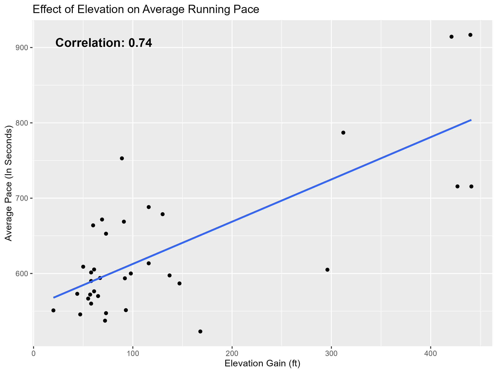
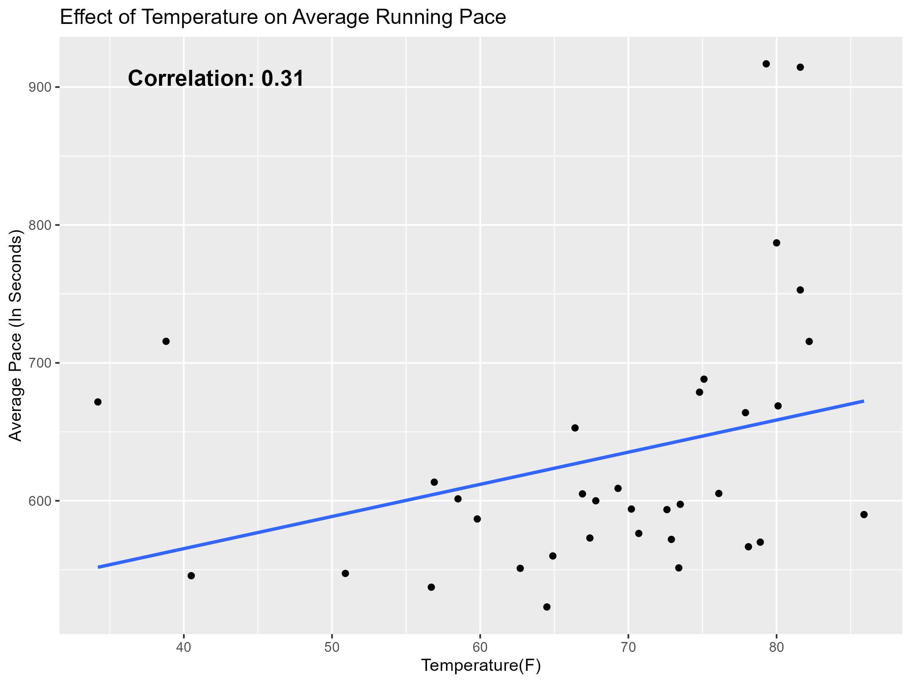

# Personal Run Tracker Analysis

This project explores my personal running data collected from the **Nike Run Club** app, enhanced with **historical weather data** pulled from the [WeatherAPI](https://www.weatherapi.com/). The goal is to evaluate how factors such as **temperature**, **elevation gain** and **cadence** may have influenced my running performance (measured by average pace).

## Project Objective
To combine running performance metrics with weather and environmental data to:
- Understand what variables have the biggest impact on my running pace.
- Visualize these relationships through statistical plots.
- Practice ETL (Extract, Transform, Load), API integration, and exploratory data analysis (EDA) using Excel, Python, and R

## Tools
- **Microsoft Excel** – Used as the input and output format for the dataset. Run data from the Nike Run Club app was manually logged here and the final merged dataset (with weather data) was exported back to Excel to prepare for analysis and visualization.
- **Python** – Used to read and clean data from the Excel spreadsheet (`pandas`), retrieve historical weather conditions from WeatherAPI (`requests`), merge the weather data with the original dataset, and export the final dataset as a new Excel file.
- **WeatherAPI** – A free weather data API used to retrieve weather data such as temperature and condition based on a run's date, time, and location.
- **R** – Used for cleaning, transforming, visualizing and analyzing data. Explored potential relationships between pace and variables like temperature, elevation gain, and cadence. 

## Analysis
- Calculated **Pearson correlation coefficients** between average pace and **temperature**, **elevation gain**, and **cadence**.
- Built a **linear regression model** to evaluate which variables have the strongest influence on running pace.
- Filtered out extreme outliers (e.g., marathon) to avoid skewed analysis.

## Visualization

Plots comparing pace against various factors:

